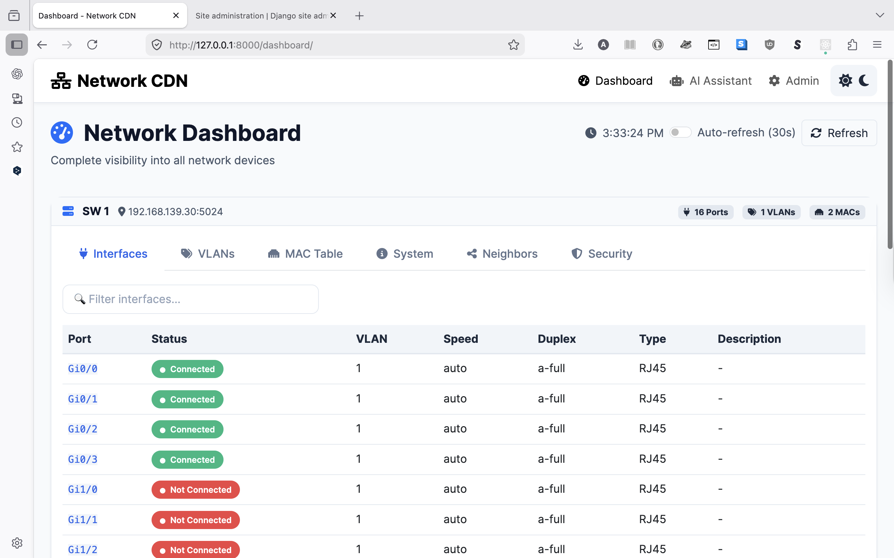
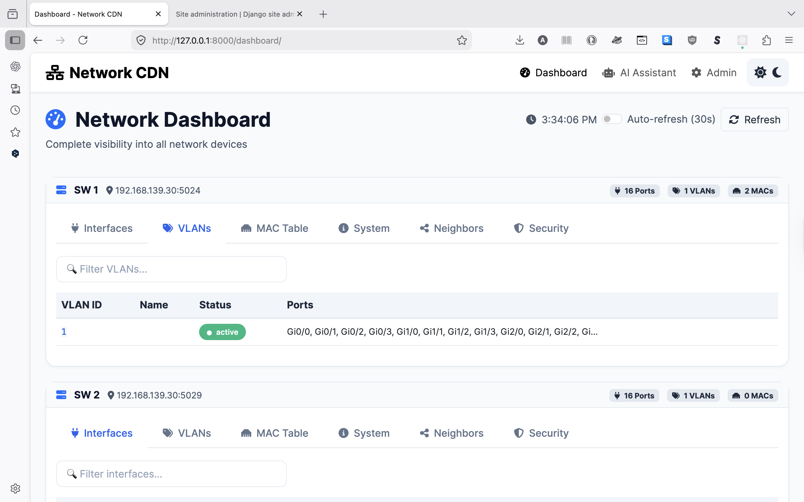
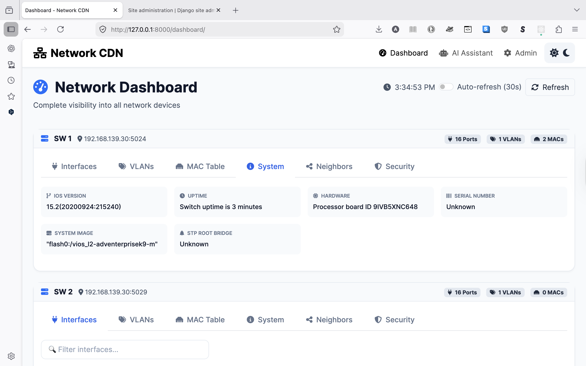
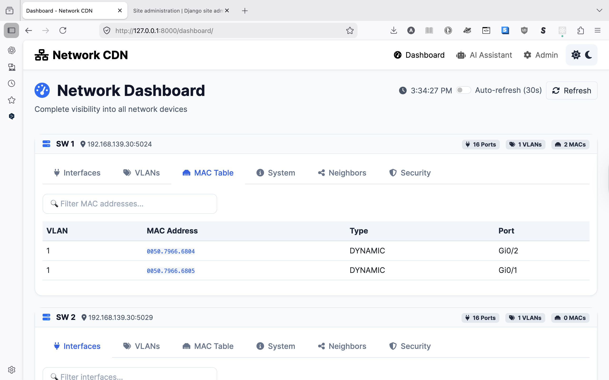
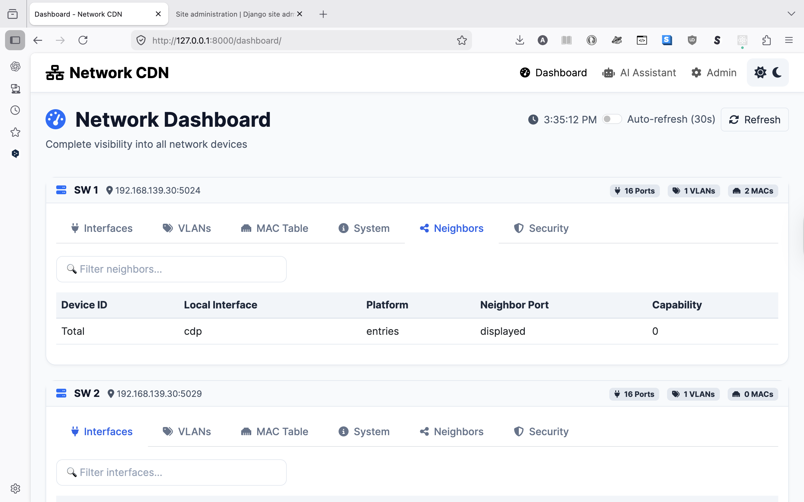
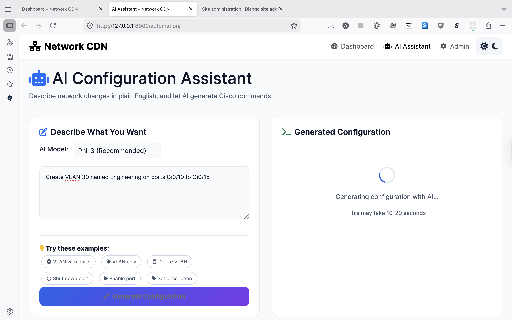
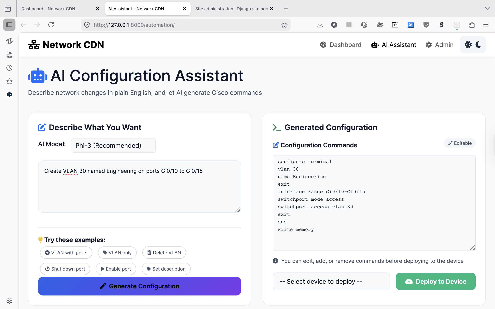
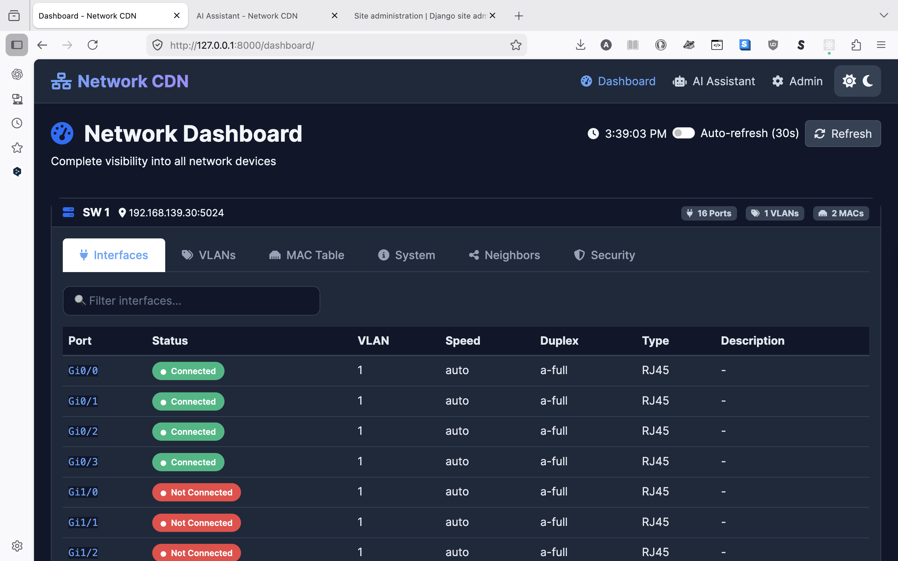
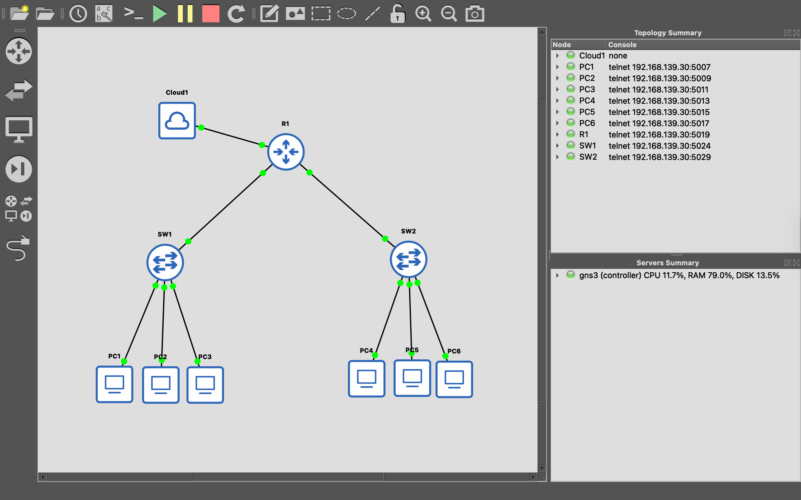

# Network CDN (Configuration Delivery Network)

[](https://www.python.org/)
[](https://www.djangoproject.com/)
[](https://opensource.org/licenses/MIT)

## 📌 Overview

**Network CDN** is a web-based network automation platform that provides real-time visibility into Cisco switches and AI-powered configuration generation. The name "CDN" (Configuration Delivery Network) reflects its purpose: delivering network configurations as efficiently as a CDN delivers content.

### Key Features

- **Real-time Dashboard** - Monitor switch interfaces, VLANs, MAC addresses, and CDP neighbors
- **AI Configuration Assistant** - Generate Cisco commands from natural language using local LLMs (Ollama)
- **Dark/Light Mode** - Comfortable viewing in any environment
- **Multi-Device Support** - Manage multiple switches from a single interface
- **Live Status Indicators** - Green = Connected, Red = Not Connected

---

## 🏗️ Architecture


---

## 📸 Screenshots

### Dashboard - Interfaces Tab
*Real-time interface status with color-coded indicators*



### Dashboard - VLANs Tab
*Complete VLAN table with port assignments*



### Dashboard - System Information
*Device details, uptime, and hardware information*



### Dashboard - MAC Address Table
*MAC address learning and port mapping*



### Dashboard - CDP Neighbors
*Directly connected device discovery*



### AI Assistant - Generating Configuration
*Natural language to Cisco commands*



### AI Assistant - Deploy Configuration
*Editable commands with one-click deployment*



### Dark Mode Support
*Professional dark theme for low-light environments*



### GNS3 Lab Environment
*Emulated network topology for testing*



---

## 🚀 Features in Detail

### 1. Real-time Dashboard

| Feature | Description |
|---------|-------------|
| **Interface Status** | View all switch ports with connected/notconnected status |
| **VLAN Management** | Complete VLAN table with ID, name, status, and port assignments |
| **MAC Address Table** | See which MAC addresses are learned on which ports |
| **CDP Neighbors** | Discover directly connected Cisco devices |
| **System Information** | IOS version, uptime, hardware, and serial number |
| **Port Security** | View port security status and MAC address limits |

### 2. AI Configuration Assistant

| Feature | Description |
|---------|-------------|
| **Natural Language Input** | Type what you want (e.g., "Create VLAN 20 for HR on ports 5-8") |
| **Local LLM Processing** | Uses Ollama with Phi-3 or Llama models (no cloud API) |
| **Command Generation** | AI generates Cisco IOS configuration commands |
| **Editable Commands** | Review and modify commands before deployment |
| **One-Click Deployment** | Deploy configurations directly to switches |

### 3. User Experience

| Feature | Description |
|---------|-------------|
| **Dark/Light Mode** | Toggle between themes with persistent preference |
| **Auto-Refresh** | Configurable 30-second auto-refresh for monitoring |
| **Search/Filter** | Quick filtering of interfaces and VLANs |
| **Responsive Design** | Works on desktop, tablet, and mobile devices |

---

## 🛠️ Technology Stack

| Category | Technologies |
|----------|--------------|
| **Backend** | Django 5.0, Python 3.12 |
| **Network Automation** | Telnet, Expect scripts, Cisco IOS CLI |
| **AI/LLM** | Ollama, Phi-3, Llama 3.2 |
| **Frontend** | HTML5, CSS3, JavaScript, Bootstrap 5 |
| **Database** | SQLite (development), PostgreSQL (production ready) |
| **Lab Environment** | GNS3, Cisco vIOS L2 |

---

## 📋 Prerequisites

| Requirement | Version |
|-------------|---------|
| Python | 3.12+ |
| Django | 5.0+ |
| Ollama | Latest |
| GNS3 | 3.0+ (for lab testing) |
| External HDD | 10GB+ free space (for models) |

---

## ⚙️ Installation

### 1. Clone the Repository

```bash
git clone https://github.com/mnsb-dev/network-cdn.git
cd network-cdn

2. Activate Virtual Environment
bash
python3 -m venv venv
source venv/bin/activate  # On Windows: venv\Scripts\activate

3. Install Dependencies
bash
pip install -r requirements.txt

4. Configure Ollama
bash
# Pull the Phi-3 model (or use llama3.2)
ollama pull phi3

# Keep Ollama running in a separate terminal
ollama serve

5. Run Django
bash
# Run migrations
python manage.py migrate

# Create superuser (if not already done)
python manage.py createsuperuser

# Start the server
python manage.py runserver

6. Access the Application
Application	URL
Dashboard	http://localhost:8000/dashboard/
AI Assistant	http://localhost:8000/automation/
Admin Panel	http://localhost:8000/admin/

7. Add Your Switch
Go to http://localhost:8000/admin

Log in with your superuser credentials (admin / admin)

Click Add next to Devices

Enter your switch details:

Name: SW1

Host: 192.168.139.30 (your GNS3 Linux VM IP)

Port: 5024 (your switch console port)

Password: (leave blank if no password)

Click Save

📁 Project Structure
text
django_project/
├── manage.py
├── db.sqlite3
├── requirements.txt
├── README.md
├── cdn_project/
│   ├── settings.py
│   ├── urls.py
│   └── wsgi.py
├── devices/
│   ├── models.py
│   ├── views.py
│   ├── telnet_helper.py
│   ├── ollama_helper.py
│   ├── admin.py
│   └── templates/devices/
│       └── dashboard.html
├── automation/
│   ├── views.py
│   ├── urls.py
│   └── templates/automation/
│       └── ai_config.html
├── static/
│   ├── css/
│   │   └── dashboard.css
│   └── js/
│       └── dashboard.js
└── screenshots/
    └── (screenshots here)
🧪 Testing
Test Connection to Switch
bash
python3 -c "
from devices.telnet_helper import run_command
output = run_command('192.168.139.30', 5024, 'show version')
print(output[:500])
"
Test AI Configuration Generation
Open http://localhost:8000/automation/

Type: Create VLAN 20 named HR on ports Gi0/5 to Gi0/8

Click Generate

Review the generated commands

Select your switch

Click Deploy

🔮 Future Enhancements
Configuration history and rollback

Multi-device bulk operations

SNMP integration for performance metrics

Email/Slack alerting

Configuration backup and restore

REST API for external automation

Docker containerization

📄 License
This project is licensed under the MIT License.

👨‍💻 Author
MNSB

GitHub: @mnsb-dev

🙏 Acknowledgments
Harvard CS50 for Python and Django foundation

Cisco DevNet for networking concepts

Ollama for local LLM capabilities

GNS3 for network emulation

